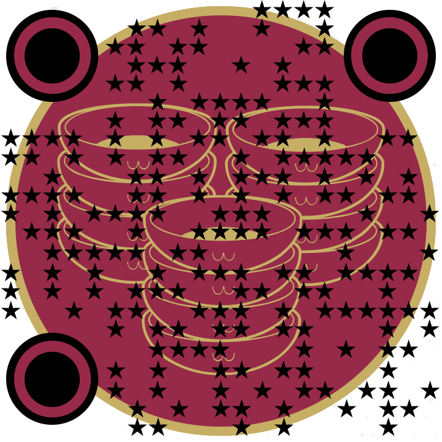

# QRRestaurant

## Documentanción de la metodología Scrum 
### Semana del 11/03 al 18/03
Esta semana hemos repartido el trabajo entra de cada uno de los miembros del grupo.Las tareas principales que hemos llevado a cabo durante esta semana son las siguientes:
1. Documentación de la primera práctica. Hemos utilizado Google Doc para que sea colaborativo. 
2. Creación del respositorio en GitHub. 
3. Creación de la base de datos en el servidor de la UCO. 
4. Creación del Backlog en Taiga. Para acceder al backlog público del proyecto use este enlace **[Backlog](https://tree.taiga.io/project/cristiancosano-qr-restaurant)**
5. Escoger las tecnologías usadas para el frontend y el backend de la aplicación:
    + Node.js (Backend)
    + Html, CSS, JavaScript (Fronted)
    + MySQL (Base de datos)

6. Creación de una instancia en la plataforma **[Heroku](https://www.heroku.com/)**, la cual vamos a usar como servidor. En dicha instancia tenemos desplegada nuestra aplicación con despliegue continuo.

### Semana del 22/03 al 28/03
Durante esta semana, todo el equipo hemos trabajado en la especificación de requisitos del proyecto que selecionamos.  Hemos realizado 3 tareas principales: 
1. **Captura de requitos.** Esto lo hemos realizado a través de una entrevista al profesor de la cual pudimos sacar un mapa conceptual del proyecto
2. **Definición de requisitos.** A partir de ese mapa conceptual definimos una lista previa de requisitos formulados en un lenguaje formal. 
3. **Diagrama de casos de uso.** Elaboramos el diagrama de casos de uso a partir de la lista de requisitos que sacamos con anterioridad
4. **Validación de requisitos.** Mediante una matriz de trazabilidad comprobamos que los requisitos estaban cubiertos por al menos un caso de uso. 

### Semana del 05/04 al 11/04
En esta semana hemos trabajado en la finalización de la práctica 2, centrandonos sobre todo en el modelado de requisitos en UWE. 
A principios de semana realizamos un reparto de los diagramas que cada uno iba a realizar y llevamos un seguimiento a través del backlog. 
1. **Técnica Walk-throughs.** Utilizamos está técnica de validación de requisitos conjuntamente con el profesor, que nos ofreció feed-back de como estaba elabaroda nuestra lista de requisitos y cuales nos sobraban o faltaban. 
2. **Auditoria**. Antes de está técnica ya tenías la lista de requisitos prácticamente cerrada pero, todo el equipo realizamos una última lectura del enunciado del problema y de la lista de requisitos para ver si nos faltaba alguno. Después de realizar la auditoría tuvimos que añadir varios requisitos nuevos que especificamos en la memoria. 
3. **Modelado de requisitos en UWE**. Finalmente, nos familiarizamos con el modelado en UWE, aprendimos la sintaxis y nos pusimos a modelar cada requito. Elaboramos el digrama de casos de uso y cada actividad de nuestro sistema. Cada diagrama esta en este enlace: **[diagramas](https://github.com/cristiancosano/QRRestaurant/tree/main/img/diagramas%20de%20actividad)**.
4. **Sketches o bocetos**. Hemos utilizado estos bocetos en HTML5 y Bootstrap 5 para tener una idea más clara de como va a ser la interacción de nuestro sistema y validar mediante esta técnica todos los requisitos. Enlace a los bocetos: **[Sketches](https://cristiancosano.github.io/QRRestaurant/)**.

### Semana del 25/04 al 29/04
En esta semana hemos trabajado en la práctica 3, modelado en UWE. Para ello nos hemos ayudado de la herramienta MagicDraw y el plugin MagicUWE. 
A principios de semana realizamos un reparto de los diagramas que cada uno iba a realizar y llevamos un seguimiento a través del backlog.
Las historias de usuario que llevamos a cabo fueron: 
1. **Modelo de contenido.** Aquí trabajamos en el primer modelo, el de contenido.
2. **Modelo de usuario.** Realizamos el modelo de usuario.

### Semana del 29/04 al 02/05
En esta semana seguimos trabajado en la práctica 3, modelado en UWE. Para ello nos hemos ayudado de la herramienta MagicDraw y el plugin MagicUWE. 
A principios de semana realizamos un reparto de los diagramas que cada uno iba a realizar y llevamos un seguimiento a través del backlog.
Las historias de usuario que llevamos a cabo fueron: 
1. **Modelado de flujo de proceso.** Aquí trabajamos en el primer modelo, el de contenido.

### Semana del 06/05 al 15/05
En esta semana comenzamos a trabajar en la implementación del código, ayudandonos de todos los diagramas que hemos realizado en UWE y partiendo de los requisitos del sistema.  
A principios de semana realizamos un reparto de los diagramas que cada uno iba a realizar y llevamos un seguimiento a través del backlog.
Las historias de usuario que llevamos a cabo fueron: 
1. **Gestión de filtros.**
2. **Gestión de usuarios.** 
3. **Gestión de la cola.**
4. **Gestión de restaurante.** 
5. **Gestión de QRs.**
6. **Gestión de la sesión.**
7. **Base de datos.**

### Semana del 17/05 al 20/05
En este útlimo sprint hemos puesto a prueba nuestra aplicación a través de diversos test. Los test los hicimos sobre la base de datos, dimos la aplicación a usuarios externos para obtener feedback y a través de todo esto poder mejorarla.   
A principios de semana realizamos un reparto de los diagramas que cada uno iba a realizar y llevamos un seguimiento a través del backlog.
Las historias de usuario que llevamos a cabo fueron: 
1. **Test de usuario.**
2. **Test de compatibilidad.** 
3. **Test de restaurante.**
4. **Test de rendimiento.** 

